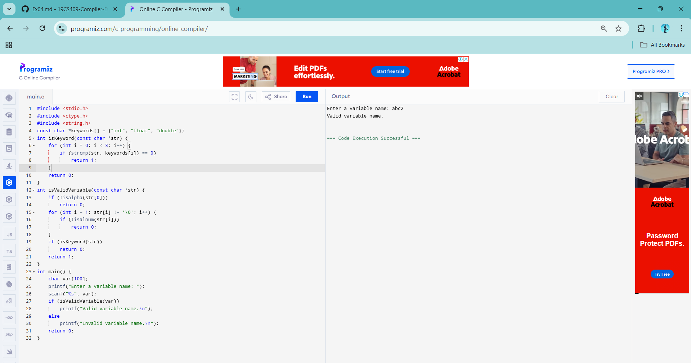
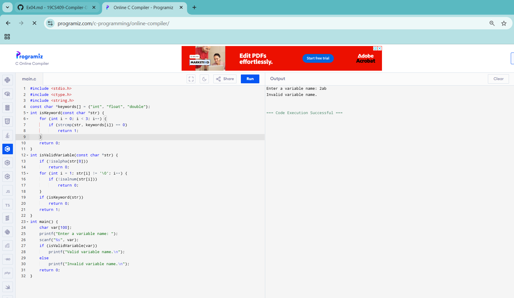

# Ex. No : 4	
# RECOGNITION OF A VALID VARIABLE WHICH STARTS WITH A LETTER FOLLOWED BY ANY NUMBER OF LETTERS OR DIGITS USING YACC
## Register Number :212223230233
## Date : 12-05-2025

## AIM   
To write a YACC program to recognize a valid variable which starts with a letter followed by any number of letters or digits.

## ALGORITHM
1.	Start the program.
2.	Write a program in the vi editor and save it with .l extension.
3.	In the lex program, write the translation rules for the keywords int, float and double and for the identifier.
4.	Write a program in the vi editor and save it with .y extension.
5.	Compile the lex program with lex compiler to produce output file as lex.yy.c. eg $ lex filename.l
6.	Compile the yacc program with YACC compiler to produce output file as y.tab.c. eg $ yacc –d arith_id.y
7.	Compile these with the C compiler as gcc lex.yy.c y.tab.c
8.	Enter a statement as input and the valid variables are identified as output.

## PROGRAM
```
#include <stdio.h>
#include <ctype.h>
#include <string.h>
const char *keywords[] = {"int", "float", "double"};
int isKeyword(const char *str) {
    for (int i = 0; i < 3; i++) {
        if (strcmp(str, keywords[i]) == 0)
            return 1;
    }
    return 0;
}
int isValidVariable(const char *str) {
    if (!isalpha(str[0]))
        return 0;
    for (int i = 1; str[i] != '\0'; i++) {
        if (!isalnum(str[i])) 
            return 0;
    }
    if (isKeyword(str))
        return 0;
    return 1;
}
int main() {
    char var[100];
    printf("Enter a variable name: ");
    scanf("%s", var);
    if (isValidVariable(var))
        printf("Valid variable name.\n");
    else
        printf("Invalid variable name.\n");
    return 0;
}
```


## OUTPUT 

## RESULT
A  YACC program to recognize a valid variable which starts with a letter followed by any number of letters or digits is executed successfully and the output is verified.


